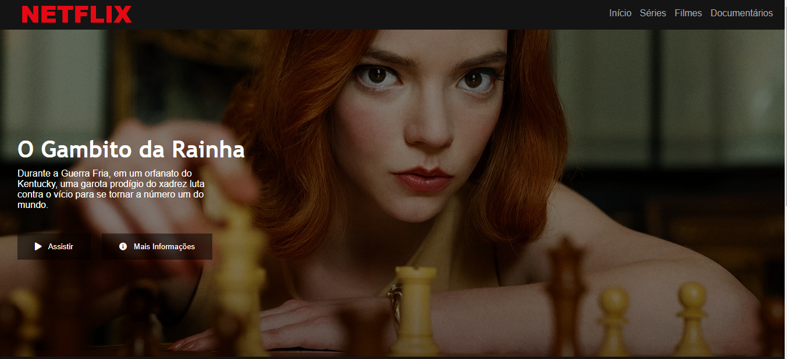
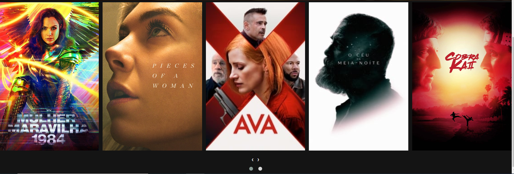
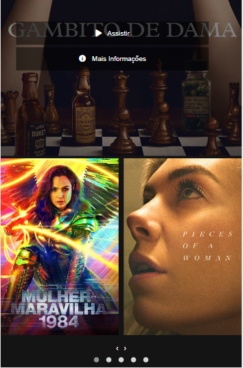

# netflix-interface

Projeto desenvolvido no Bootcamp da [**Digital Innovation One**](https://digitalinnovation.one/)

**Objetivo:** recriar o layot inicial da Netflix

**Stacks**
 * HTML
 * CSS
 * JavaScript

**Biblioteca JavaScript**
 * Jquery

**PLugin**
 * Owl Carousel
 
 **Desktop**

 

**Mobile**

 
